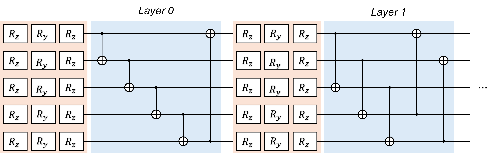

# CustumQuantumTensorflow

This repository provides a TensorFlow-based implementation of quantum circuits as custom layers, designed to bridge classical machine learning and quantum computing. The framework enables efficient simulation of quantum algorithms with GPU acceleration on Windows environments, offering improved scalability and computational efficiency compared to existing implementations such as PennyLane (Flax), TensorFlow Quantum, and PyTorch-based approaches.

## Custom Q-TF Layer

The core of this framework is a fully customizable TensorFlow module that provides a set of fundamental quantum operations for building arbitrary quantum circuits. Features include:

- Single-qubit rotation gates: `R_x`, `R_y`, `R_z`
- Two-qubit entangling gates: Controlled-Z (CZ)
- Interaction with classical states through amplitude and angle embeddings
- Pauli measurements and probabilistic decoding
- Modular structure for adding new quantum operations easily

Although the current implementation focuses on a parameterized variational quantum circuit with strongly entangling layers, the layer is flexible and can be adapted to alternative circuit architectures.

### Quantum Circuit Example

- Each qubit undergoes a sequence of three parameterized single-qubit rotations (`R_z(θ1)`, `R_y(θ2)`, `R_z(θ3)`)
- Qubits are entangled using controlled operations in a ring topology, with progressively skipping connections per layer
- Final quantum state is measured via the Pauli-Z operator on each qubit, producing a continuous vector used as input for classical layers



## Installation

This repository requires **Python 3.9**. All dependencies are listed in `requirements.txt`.

Clone the repository:

```bash
git clone https://github.com/Kibbu92/Tensor_QTF.git
cd Tensor_QTF
```

Install dependencies:
```bash
pip install -r requirements.txt
```

## Citation
If you use this repository in your research, please cite the corresponding paper:

Carbone, A. "Efficient Quantum Circuit Implementation with TensorFlow Custom Layer."
