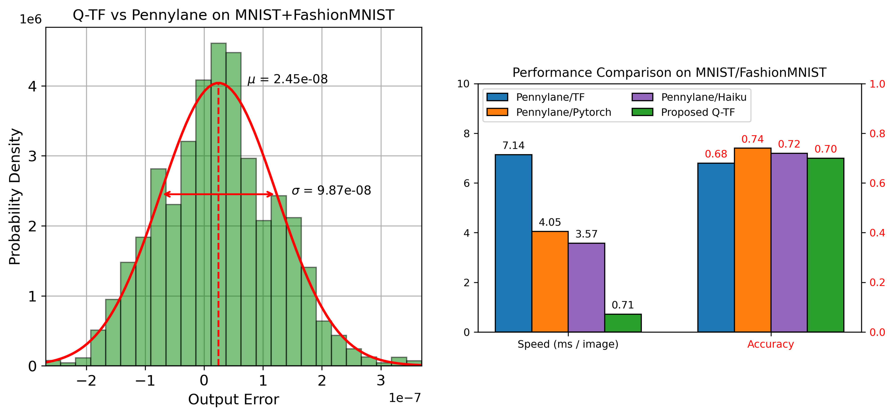

# Summary

The integration of quantum computing with classical machine learning is emerging as a promising research direction, 
with the potential to significantly enhance model expressivity and computational efficiency [@haldorai:2024, @sood:2024, 
@peral:2024, @zeguendry:2023]. However, despite strong theoretical foundations, practical implementations are still 
largely limited to simulation-based approaches due to the current constraints of quantum hardware. A similar situation
occurred in the development of artificial neural networks, which were first conceptualized in the mid-20th century 
[@mcculloch:1943] but became practically viable only in recent decades with the advent of modern computational resources
and large-scale datasets.

This repository introduces **QuLayer**, a TensorFlow-native framework for building and simulating quantum circuits 
directly within classical deep learning pipelines. The primary goal of this software is to simplify the development 
of Hybrid Quantum Neural Networks (HQML) by removing the need for external quantum simulation libraries. Unlike 
existing solutions, QuLayer is implemented entirely using standard TensorFlow operations. This design enables native
GPU acceleration and allows the framework to run efficiently on Windows systems without requiring Linux-based 
environments or specialized dependencies. As a result, the framework lowers the barrier to entry for researchers 
interested in quantum machine learning, including those with limited experience in quantum computing.

The framework provides a modular and extensible set of quantum operations, allowing users to construct flexible 
parameterized quantum circuits and integrate them seamlessly into existing machine learning workflows.

# Statement of Need

HQML has gained increasing attention due to its potential advantages in both computational efficiency and model expressivity
[@henderson:2020, @ceschini:2025]. Existing frameworks such as PennyLane [@bergholm:2018] and TensorFlow Quantum [@broughton:2020] 
libraries offer powerful tools for simulating quantum circuits and integrating them with classical machine learning models.
However, they often introduce several practical challenges, including complex dependencies, reliance on external simulation backends, 
and limited support for GPU acceleration in certain configurations. Additionally, many of these tools are primarily optimized for 
Linux-based environments, making them less accessible to users working on native Windows systems.

These limitations can significantly hinder experimentation, particularly for researchers who:
- do not have access to Linux-based infrastructures  
- require efficient GPU-based computation  
- come from non-quantum backgrounds and need simpler tools  

The proposed custum quantum layer (QuLayer.py) addresses these issues by providing a fully TensorFlow-native implementation of 
quantum circuits. By relying exclusively on TensorFlow operations, the framework eliminates external dependencies and enables 
seamless integration with existing deep learning pipelines. This approach makes HQML more accessible, efficient, and easier 
to adopt across a broader research community.

# State of the field

The field of HQNNs is dominated by well-established frameworks that enable quantum circuit simulation and integration
with classical deep learning models.

Among these, PennyLane represents one of the most widely used solutions. It provides high-level abstractions for quantum
circuit construction, including data encoding strategies and variational templates. A key strength of PennyLane lies in 
its flexibility, supporting the integration with TensorFlow [@tensorflow:2015], PyTorch [@pytorch:2019], and FLAX/JAX 
[@flax:2020, @jax:2018] through dedicated interface layers (e.g., qml.qnn.KerasLayer, qml.qnn.TorchLayer). Similarly, 
TensorFlow Quantum enables the implementation of HQNNs by using Cirq [@Cirq:2025] as its underlying quantum circuit simulator.

Despite their capabilities, these frameworks share a common architectural paradigm: quantum circuits are treated as external 
components executed outside the core machine learning graph. This leads to:
- reliance on external quantum circuit simulator 
- additional wrapper layers to ensure compatibility with frameworks  
- cross-framework data conversion and execution overhead 

## Build vs Contribute Justification 

In contrast, QuLayer adopts a fundamentally different design approach by embedding quantum operations directly into TensorFlow 
as native differentiable operations.

| Aspect | Existing frameworks | QuLayer |
|------|--------------------|----------|
| Quantum execution | External backend | Native TensorFlow ops |
| Integration | Adapter layers | Direct graph integration |
| GPU usage | Indirect | Native |
| System dependency | High | Minimal |

This makes QuLayer not a replacement for quantum hardware simulators, but a lightweight alternative for HQNN research.

# Software design

## Custom Quantum Layer

The proposed framework implements a fully customizable TensorFlow layer that provides a set of fundamental quantum operations used as 
building blocks for parameterized quantum circuits.

The layer supports:
- amplitude and angle embeddings for classical-to-quantum encoding  
- Pauli-Z measurement and probabilistic decoding  
- single-qubit rotation gates around the x-, y-, and z-axes  
- controlled-Z entangling operations

Although the current implementation does not include the full set of possible quantum gates, it is sufficient to represent a wide class of 
variational quantum circuits. The modular design allows additional operations to be incorporated with minimal effort. Indeed, by releasing 
the framework as open-source software, the objective is to encourage collective development and continuous expansion of the available quantum 
functionalities. The circuit architecture used in this work is inspired by circuit-centric variational models [@schuld:2020] and is composed 
by amplitude encoding followed by strongly entangling layers. Although the present study focuses on this particular configuration, the quantum 
layer is not restricted to it and can be readily adapted to alternative circuit architectures.

In particular, the quantum circuit consists on (see Figure):
- Sequential application if single-qubit rotations ($$R_z(θ_1)$$, $$R_y(θ_2)$$, $$R_z(θ_3)$$).
- Entanglement using controlled operations in a ring topology, with progressively skipping connections per layer
- Measurement via expectation values of Pauli-Z operators 

  

## HQNN implementation

The proposed HQNN takes as input $28 \times 28$ grayscale images from the MNIST and FashionMNIST datasets. The input is processed through a sequence 
of convolutional blocks designed to extract hierarchical feature representations. The first hidden stage consists of a two-dimensional convolutional 
layer with $n$ filters and a $2 \times 2$ kernel. The layer uses *same* padding to preserve spatial dimensions and applies a ReLU activation function 
to introduce non-linearity. This is followed by a max pooling operation with a $2 \times 2$ pooling window and a stride of $1 \times 1$, which reduces 
redundancy while retaining the most relevant spatial features.

This convolution–pooling block is repeated three times, with the number of filters progressively increasing to $2n$ and $4n$. After the final convolutional 
stage, the output tensor has shape $(\text{batch}, m, m, 4n)$, where $m$ denotes the resulting spatial resolution after max pooling operations. The tensor 
is reshaped into $(\text{batch}, m \cdot m, 4n)$ before being passed to the quantum component. This transformation ensures that spatial information is 
reorganized into a format compatible with the quantum encoding process, allowing each feature vector to be processed independently.

The quantum embedding uses amplitude encoding, and the number of required qubits $n_Q$ is given by:

$$
n_Q = 2 + \log_2(n)
$$

From this relationship, it follows that the number of convolutional filters and the number of qubits are strictly coupled through a logarithmic mapping. 
Consequently, fixing one of the two quantities determines the other. In practical implementations, it is common to select the number of filters $n$ such that 
$n_Q$ is an integer value. This is typically achieved by constraining $n$ to be a power of two, i.e., $n = 2^k$, which ensures exact representability in the 
logarithmic mapping without requiring rounding or truncation.

# Research Impact Statement

The proposed QuLayer framework provides a reproducible and GPU-accelerate implementation of HQNNs through a fully TensorFlow-native design, embedding parameterized 
quantum circuits directly into standard deep learning workflows. The framework has been rigorously evaluated in terms of accuracy and computatinal time using standard 
benchmark datasets (MNIST and FashionMNIST). 

A key aspect of this work is its reproducibility: the implementation is fully open-source, relies exclusively on standard TensorFlow operations, and is compatible
with GPU execution on Windows systems without requiring external quantum simulation backends. These characteristics make QuLayer immediately usable for hybrid 
quantum-classical research workflows, enabling faster experimentation and reducing system-level complexity in practical applications.

## Accuracy and Computational Performance

The QuLayer implementation was validated against a reference quantum circuit built using PennyLane everaging its AmplitudeEmbedding() function for amplitude 
mapping and the StronglyEntanglingLayers() function for parameterized quantum gates. The observed error distribution is tightly concentrated, with:

- Mean error: $2.45 \times 10^{-8}$  
- Standard deviation: $9.87 \times 10^{-8}$  

This confirms that the proposed tensor-based formulation preserves the functional behavior of variational quantum circuits within numerical limits.

  

In terms of computational efficiency, QuLayer provides consistent speedups compared to widely used HQNN implementations. Experimental results show:

- up to **10× reduction in execution time** compared to TensorFlow-based PennyLane integrations  
- approximately **5× improvement** compared to PyTorch and JAX/Haiku-based implementations  

Importantly, these performance gains are obtained under controlled conditions where model architectures, hyperparameters, and training procedures are strictly aligned
across all frameworks. This ensures that reported improvements reflect differences in execution strategy rather than differences in model design or optimization setup.
No degradation in predictive performance is observed across MNIST and FashionMNIST experiments, confirming that efficiency improvements do not compromise model accuracy.

## Practical Significance and Reproducibility

A key aspect of this work is its focus on accessibility and reproducibility. The entire implementation is based exclusively on standard TensorFlow operations, enabling 
native GPU acceleration on Windows systems without requiring external quantum simulation backends or Linux-based environments. This design significantly reduces 
system-level complexity and lowers the barrier to entry for researchers in HQNN, particularly those without access to specialized quantum computing infrastructures. 
All experiments are conducted using publicly available datasets, standardized preprocessing pipelines, and consistent training configurations across frameworks. 
The full implementation is released as open-source software, enabling direct reproduction and extension of the reported results.

## Scope and Interpretation

It is important to emphasize that QuLayer is not intended as a replacement for dedicated quantum hardware simulators, but rather as a lightweight and efficient framework for 
embedding variational quantum circuits within machine learning workflows. Its primary contribution lies in enabling fast experimentation and integration of quantum-inspired 
models within widely used deep learning ecosystems. Overall, QuLayer provides a practical and immediately usable tool for hybrid quantum-classical research, enabling faster 
development cycles, improved accessibility, and scalable experimentation within GPU-accelerated environments.

# AI usage disclosure

Generative AI tools were used exclusively as writing assistants to improve the clarity, structure, and linguistic quality of the manuscript and documentation. 
Their use was limited to language refinement, formatting support, and textual organization. 

Importantly, no generative AI tools were used in the design of the technical methodology, the development of the main concepts, the experimental setup, or the
implementation of the Python code. All code was manually written, reviewed, and tested without AI-assisted code generation. The author retains full responsibility 
for the correctness, validity, and reproducibility of all technical contributions presented in this work.

# References

(References are provided in `paper.bib`)
